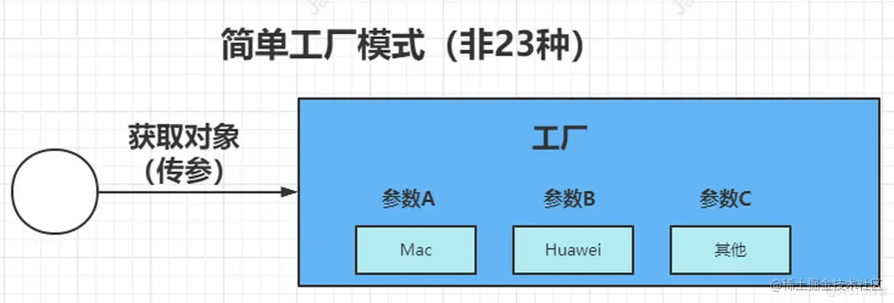
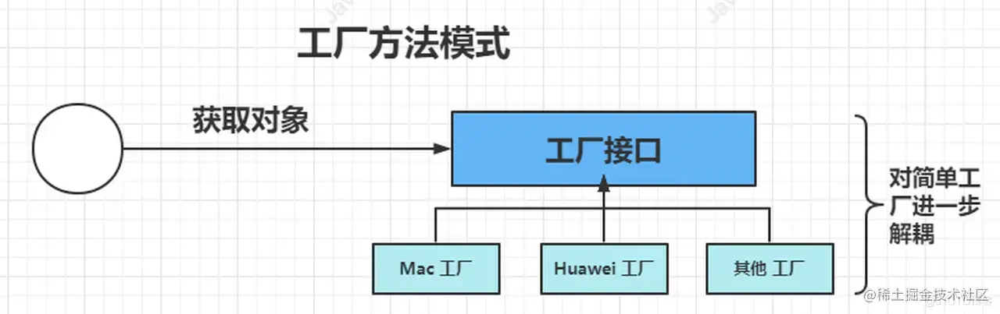
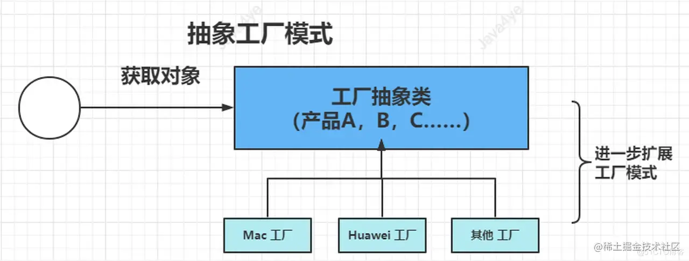

# 工厂模式

📚︎ 工厂模式一种对**对象的创建过程**的一种封装，只需要**通过调用工厂类的方法**来获取对象，而无需与具体对象的创建逻辑来进行耦合。<br/><br/>
📑 其中主要有：🏷**简单工厂(工厂模式的基础)**、🏷**方法工厂**、🏷**抽象工厂**

## 📍 简单工厂
###  原理图 🖼
<hr/>



### 抽取公共接口 🎘
<hr/>
这里以画图器为举例进行说明，先抽取画图器的绘画的接口。
<br/>
<br/>

```js
public interface Shape {
    /**
     * 画图
     */
    void draw();
}
```
### 接口的实现类 🔌
<hr/>
方形和圆形的两个实现类，继承了图形的接口。
<br/>
<br/>

```js
//圆形的实现类
public class CircleShape implements Shape {
    public final String NAME = "圆形";

    public void draw() {
        System.out.println("画"+NAME);
    }
}

//方形的实现类
public class ReactShape implements Shape {
    public final String NAME = "方形";

    public void draw() {
        System.out.println("画"+NAME);
    }
}
```
### 定义工厂类 🏭
<hr/>
这里的工厂类就可以根据传入不同的参数创建不同的实体类。
<br/>
<br/>

```js
public class ShapeFactory {
    private final String Tag = "ShapeFactory";

    public Shape getShape(String type){
        Shape shape = null;
        if(type.equalsIgnoreCase("circle")){
            shape = new CircleShape();
        }
        if(type.equalsIgnoreCase("React")){
            shape = new ReactShape();
        }

        return shape;
    }
}
```

### 主方法 🏃
<hr/>
调用简单的工厂的方法
<br/>
<br/>

```js
//简单工厂类模式
private static void simpleFactory() {
    ShapeFactory shapeFactory = new ShapeFactory();
    Shape circle = shapeFactory.getShape("circle");
    circle.draw();
    Shape react = shapeFactory.getShape("react");
    react.draw();
}
```

## 📍 工厂方法模式
###  原理图 🖼
<hr/>


<br/>
<br/>

**是通过抽取一个工厂的接口，由不同的工厂实现类去创建不同的对象。**
这里以读取不同格式文件的方法为简单举例。

### 抽取工厂的公共接口 🎘
<hr/>

```js
public interface ReaderFactory {
    Reader getReader();
}
```

### 工厂的实现类 🏭
<hr/>

```js
public class JpgReaderFactory implements ReaderFactory {

    public Reader getReader() {
        return new JpgReader();
    }
}

public class PngReaderFactory implements ReaderFactory {
    public Reader getReader() {
        return new PngReader();
    }
}
```
### 不同文件共同的读接口和不同的文件的继承类 
<hr/>

```js
public interface Reader {
    void read();
}

public class JpgReader implements Reader {
    public void read() {
        System.out.println("jpgReader");
    }
}

public class PngReader implements Reader {
    public void read() {
        System.out.println("PngReader");
    }
}
```

### 主方法
<hr/>

```js
    private static  void Factory(){
        ReaderFactory jpgReaderFactory = new JpgReaderFactory();
        ReaderFactory PngReaderFactory = new PngReaderFactory();
        Reader jpg = jpgReaderFactory.getReader();
        Reader png = PngReaderFactory.getReader();
        jpg.read();
        png.read();
    }
```
<br/>
<br/>
这种模式下每个对象的创建有不同工厂实例进行创建的。实现创建类的解耦。


## 📍 抽象工厂模式
###  原理图 🖼
<hr/>


<br/>
<br/>

**是一种创建型设计模式，它提供了一种方式来创建一系列相关或依赖对象的接口，而无需指定具体实现类。该模式通过定义抽象工厂接口和一组具体工厂类来实现。**
解释就是：对工厂的处理不同方法，再进行一步接口的提升。
<br/>
比如华为和苹果都生产电脑和手机。

### 抽取生产手机和电脑工厂的公共接口 🎘
<hr/>

```js
public abstract class AbstractFactory {
    //生产手机
    public abstract Phone createPhone();
    //生产电脑
    public abstract Laptop createLaptop();
}
```

### 工厂的实现类 🏭
<hr/>

```js
//华为工厂
public class HuaweiFactory extends AbstractFactory{
    @Override
    public Phone createPhone() {
        return new HuaWeiPhone();
    }
​
    @Override
    public Laptop createLaptop() {
        return new HuaWeiLaptop();
    }
}

//Apple工厂
public class AppleFactory extends AbstractFactory{
    @Override
    public Phone createPhone() {
        return new ApplePhone();
    }
​
    @Override
    public Laptop createLaptop() {
        return new AppleLaptop();
    }
}

```
**省略苹果和华为实现手机和电脑的接口**
。。。。。。
